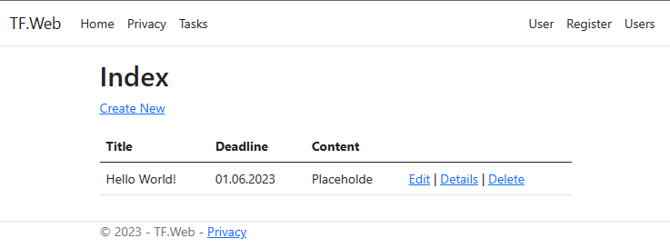
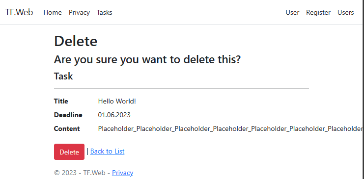

# TaskFlow_Web

TaskFlow_Web is a web application developed using ASP.NET and C# for managing tasks and taking notes.
## Features

**Task Management**: Users can create, update, and delete tasks. They can(will) set due dates, priorities, and categories for better organization. The application also(will) provides filtering and sorting options to easily manage tasks.

**Note Taking**: Users can create, edit, and delete notes.

**User Authentication**: Users can register an account, log in, and securely(not now) access their tasks and notes.

## Screenshots

## Getting Started

Make sure to set Connection Strings